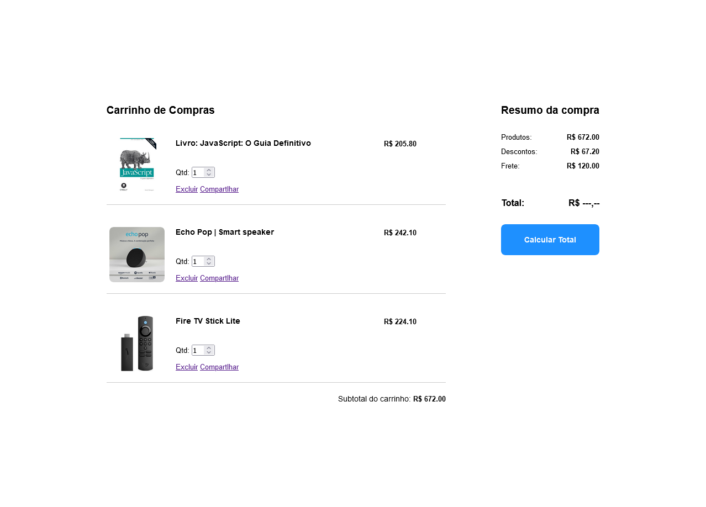
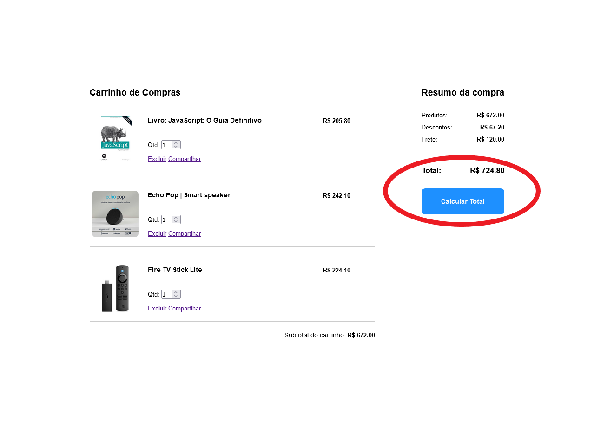

# Prática Avaliativa Final - N1

> Esta atividade avaliativa tem como objetivo integrar os conhecimentos adiquiridos até aqui na disciplina de Desenvolvimento Web I

## Requisitos e Instruções para Realização da Atividade

- Esta atividade tem como objetivo integrar diversos conhecimentos adiquiridos até aqui na disciplina de Desenvolvimento Web I, como: JavaScript Básico, ES6 e JavaScript DOM.

- A atividade consiste em implementar um sistema simplificado de carrinho de compras, como mostrado na imagem a seguir:

<div align="center">
    
</div>

- [Acesse aqui](https://drive.google.com/file/d/1putRp50HekI6zOVXFfNbFMm8ll4eT59c/view?usp=sharing) um vídeo com uma demonstração rápida do funcionamento esperado ao final da implementação de todas as funcionalidades.

- **Instruções e recursos:**

  - Use o código base, disponivel [neste link](https://codepen.io/prof_lucasmendes/pen/OPLXRbJ) como ponto de partida e para entender a estrutura que a página deve ter com todos os elementos renderizados;

  - Perceba que no código base, no link acima, a estrutura HTML traz um esqueleto estático da listagem de items. Porém, a estrutura de cada item do carrinho deve ser gerada de forma dinâmica usando JavaScript com manipulação do DOM, bem como os demais dados dinâmicos da página (subtotal, descontos, frete e total);

  - Você deve então, ao iniciar a atividade, excluir (ou comentar para não perder), o seguinte trecho dentro da div com classe `carrinho`, pois ele deve ser renderizado de forma dinâmica através do script em JavaScript:
    ```html
    <div class="item" id="item-1">
      
      <div class="item-info">
        <h3>Livro: JavaScript: O Guia Definitivo</h3>
        <div class="acoes">
          <form>
            <label>
              <span>Qtd: </span>
              <input type="number" value="2" />
            </label>
          </form>
          <div class="links">
            <a href="#">Excluir</a>
            <a href="#">Compartlhar</a>
          </div>
        </div>
      </div>
      <div class="total-item">
        <span>R$ 700.00</span>
      </div>
    </div>
    <div class="item" id="item-2">
      
      <div class="item-info">
        <h3>Echo Pop | Smart speaker</h3>
        <div class="acoes">
          <form>
            <label>
              <span>Qtd: </span>
              <input type="number" value="1" />
            </label>
          </form>
          <div class="links">
            <a href="#">Excluir</a>
            <a href="#">Compartlhar</a>
          </div>
        </div>
      </div>
      <div class="total-item">
        <span>R$ 242.10</span>
      </div>
    </div>
    <div class="item" id="item-3">
      
      <div class="item-info">
        <h3>Fire TV Stick Lite</h3>
        <div class="acoes">
          <form>
            <label>
              <span>Qtd: </span>
              <input type="number" value="1" />
            </label>
          </form>
          <div class="links">
            <a href="#">Excluir</a>
            <a href="#">Compartlhar</a>
          </div>
        </div>
      </div>
      <div class="total-item">
        <span>R$ 224.10</span>
      </div>
    </div>
    ```

  - O exemplo já traz as regras de estilo definidas, não havendo necessidade de modificação do CSS (a menos que altere algo na estrutura HTML gerada, em relação ao modelo);

  - O código base JavaScript define um array de objetos do tipo produto contendo as propriedades `id`, `nome`, `urlImg`, `preco`, `qtd`. Esse array será utilizado como fonte de dados para gerar a listagem de itens de forma dinâmica e calcular os valores necessários.
    ```javascript
    const carrinho = [
        {
            id: 1,
            nome: "Livro: JavaScript: O Guia Definitivo",
            urlImg: "https://m.media-amazon.com/images/I/91z1xY4ppaL._SL1500_.jpg",
            preco: 350,
            qtd: 2
        },
        {
            id: 2,
            nome: "Echo Pop | Smart speaker",
            urlImg: "https://m.media-amazon.com/images/I/71eWKwcVjnL._AC_SL1500_.jpg",
            preco: 242.1,
            qtd: 1
        },
        {
            id: 3,
            nome: "Fire TV Stick Lite",
            urlImg: "https://m.media-amazon.com/images/I/41XUvigLn0L._AC_SL1000_.jpg",
            preco: 224.1,
            qtd: 1
        }
    ];
    ```

- **Requisitos para a avaliação:**

  - (**2 scores**) Todos os itens devem ser carregados dinamicamente, de acordo com os dados do array `carrinho`;
  - (**1 scores**) O subtotal do carrinho deve ser calculado no carregamento da página e exibido nos locais adequados (perceba que o subtotal também deve aparecer no resumo da compra);
  - (**1 scores**) Os valores de desconto e frete devem ser exibidos no resumo, também ao carregar a página (esses valores podem ser definidos no próprio código, só para testes);
  - (**2 scores**) O valor total da compra (aplicando o desconto e o frete) só deve ser exibido quando o usuário clicar no botão "Calcular Total", como apresentado na imagem a seguir:
    
  - (**2 scores**) Ao modificar a quantidade de um determinado item no carrinho, os dados referentes ao valor final do item, subtotal do carrinho e desconto devem ser atualizados na página (estudo sobre o evento `onchange`);
  - (**2 scores**) Ao excluir um item ele deve ser deletado da visualização da página e todos os valores de subtotal do carrinho e desconto devem ser atualizados (verifique mais uma vez o [vídeo de demonstração](https://drive.google.com/file/d/1putRp50HekI6zOVXFfNbFMm8ll4eT59c/view?usp=sharing)).
