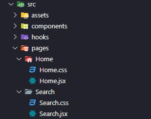

# Introdução ao Desenvolvimento Web

## Roteiro de Prática

> **_Prática 03 - Projeto Final_**
> - Nessa prática, vamos implementar a funcionalidade de busca por filmes, utilizando o componente de busca na barra de navegação superior.
> - Vamos precisar criar uma nova página em nossa aplicação para exibir os resultados de busca.
> - Para isso, vocês vão aprender a trabalhar com rotas, utilizando a biblioteca `react-router-dom` para fazer o roteamento de páginas em nossa aplicação.

> **Dicas e Instruções:**
> - **Compreenda o fluxo:** Leia todo o roteiro antes de começar (ou, pelo menos, leia cada etapa, por inteiro, antes de começar) para entender o objetivo final. Isso ajuda a evitar surpresas ao longo do caminho.
> - **Mantenha o editor organizado**: após finalizar a edição em um arquivo, feche ele no editor para não se confundir com tantos arquivos abertos.

> **Estimativa de Tempo:**
> - ***Tempo Total Estimado:*** 45min - 1h

### 01 - Instalando a biblioteca React Router Dom

> ✅ O **React Router Dom** é uma biblioteca para uso no React, onde é possível realizar o gerenciamento de rotas entre as páginas de um site, ou seja, navegar entre as páginas da aplicação. Por meio dela, é possível renderizar componentes baseado na rota que for escolhida pelo usuário, além de manipular parâmetros passados via URL.

1. Para instalar a biblioteca `React Router Dom` em nosso projeto, abra o terminal integrado na pasta do projeto e digite a linha de comando abaixo:

    ```bash
    npm install react-router-dom
    ```

### 02 - Criando a estrutura de diretórios e arquivos para nossas páginas

1. Teremos duas páginas nessa versão do nosso projeto, a página `Home` e a página de resultados de busca, que iremos chamar de `Search`.

2. Crie uma pasta chamada `pages` dentro da pasta `src`.

3. Crie duas pastas chamadas `Home` e `Search`, dentro da pasta `pages` criada anteriormente.

4. Crie um arquivo `Home.jsx` e um arquivo `Home.css` dentro da pasta `Home`.

5. Da mesma maneira, crie um arquivo `Search.jsx` e um arquivo `Search.css` dentro da pasta `Search`.

6. Certifique-se de que a estrutura das pastas e arquivos criados nos passos anteriores está correta. Veja na imagem abaixo, como deve ficar a hierarquia de pastas.

    

### 03 - Estruturando a página Home

> ⚠️ Durante o desenvolvimento dessa parte do roteiro, se você tentar abrir a aplicação no navegador, irão aparecer erros (ou até mesmo nada irá aparecer). É normal, vamos modificar a estrutura do projeto, segue o jogo.

1. Nossa aplicação já tem uma página inicial. Porém, toda a lógia dessa página e a definição de seus componentes está no arquivo `App.jsx`.
    - Essa não é uma boa prática quando temos múltiplas páginas em nossa aplicação.
    - Precisamos então remover a lógica e a definição dos componentes da página inicial do arquivo `App.jsx` para o arquivo `Home.jsx`. Confira a seguir, como você pode fazer isso.

1. Inicialmente crie o código base do componente `Home.jsx`, que será nossa página inicial. Veja o código inicial que você deve criar no arquivo `Home.jsx`:

    ```javascript
    const Home = () => {
        return (
            <h2>Página Home</h2>
        );
    };

    export default Home;
    ```

    - O elemento de título `<h2>Página Home</h2>` é somente demonstrativo, já vamos substituir pelos elementos da página inicial.

1. Agora, precisamos pegar tudo que for lógica ou definição de elementos da página inicial do arquivo `App.jsx` e colocar em `Home.jsx`.
    - O arquivo `Home.jsx` ficará com o seguinte código:

    ```javascript
    import { useFetch } from "./../../hooks/useFetch";
    import Card from "./../../components/Card";

    import "./Home.css";

    const URL_FETCH = "https://api.themoviedb.org/3/discover/movie?include_adult=false&include_video=false&language=pt-BR&page=1&sort_by=popularity.desc";

    const Home = () => {
    const { dados: filmes } = useFetch(URL_FETCH);

    return (
        <div id='home'>
            <h2 className='title'>Filmes Populares:</h2>

            <div className='movies-container'>
                {filmes &&
                filmes.results.map((filme) => <Card key={filme.id} filme={filme} />)}
            </div>
        </div>
    );
    };

    export default Home;
    ```
    - Perceba que, agora, toda a lógica para buscar os filmes e apresentá-los em Cards na página inicial está no arquivo `Home.jsx`.
    - Perceba que foi necessário ajustar as importações dos arquivos `useFetch.js` e `Card.jsx`.
    - Perceba também que importamos o arquivo `Home.css`, para aplicar qualquer CSS específico da página inicial.
        - Não teremos nenhum CSS específico para essa página, pois os estilos já estão definidos de forma global. Ou seja, o arquivo `Home.css` ficará vazio mesmo, mas vamos deixar assim mesmo, pois já temos a estrutura pronta para aplicar algum estilo específico futuramente.

1. O arquivo `App.jsx` ficará com o seguinte código após retirar a lógica e a definição dos elementos da página inicial:

    ```javascript
    import './App.css';

    import NavBar from './components/NavBar';
    import Footer from './components/Footer';

    const App = () => {

    return (
        <>
            <NavBar />

            <main>
                <div className="container">

                </div>
            </main>

            <Footer />
        </>
    );
    };

    export default App;
    ```

    - Perceba que agora, nosso componente `App.jsx` será apenas um template para nossas páginas.
    - Agora, sempre que precisarmos apresentar uma página diferente ao usuário, vamos colocá-la dentro da `div` com classe `container`. Dessa forma, todas as páginas vão ter os componentes `NavBar` e `Footer`.
        - Calma, já já vamos ver como fazer isso. Por enquanto só certifique-se de que o arquivo `App.jsx` está dessa forma.

### 04 - Configurando o roteamento de páginas com a biblioteca React Router Dom

> Vamos definir como será a navegação entre as páginas de nossa aplicação.

1. Antes de configurar as rotas de nossa aplicação, vamos criar uma estrutura básica para a nossa página de busca, editando o arquivo `Search.jsx`, da seguinte maneira:

    ```javascript
    import "./Search.css";

    const Search = () => {
        return (
            <div id='search'>
                <h2>Página de busca</h2>
            </div>
        );
    };

    export default Search;
    ```

1. Já vamos aproveitar e definir um pequeno estilo CSS que será específico para a página de buscas. Abra o arquivo `Search.css` e insira o seguinte código:

    ```css
    #search .query-text {
        color: var(--primary-color);
    }
    ```

1. Agora sim, vamos utilizar a biblioteca React Router Dom para configurar as rotas de nossa aplicação.
    - Abra o arquivo `main.jsx` e crie um objeto de configuração das rotas, através da função `createBrowserRouter()`. 
    - O trecho de código a seguir, com as configurações de rotas para nosso projeto, deve ser implementado no arquivo `main.jsx` antes da chamada à função `createRoot()`:

    ```javascript
    const router = createBrowserRouter([
        {
            path: "/",
            element: <App />,
            children: [
                {
                    path: "/",
                    element: <Home />
                },
                {
                    path: "/search",
                    element: <Search />
                }
            ]
        }
    ])
    ```

    - Após isso, dentro da função `render()`, ainda no arquivo `main.jsx`, use o componente `RouteProvider` (do pacote react-router-dom) para aplicar as configurações de rotas definidas:

    ```javascript
    createRoot(document.getElementById('root')).render(
        <StrictMode>
            <RouterProvider router={router} />
        </StrictMode>
    )
    ```

    - Explicando de forma breve:
        - O objeto `router`, criado a partir da função `createBrowserRouter()` do react-router-dom, define as configurações de roteamento que serão aplicadas em nosso projeto.
        - Estamos definindo que para o caminho raíz `/` da nossa aplicação, o React deve carregar o elemento `App` inicialmente.
        - Como subrotas (`children`), estamos definindo uma lista de páginas que serão carregadas para dentro do componente principal (`App`) a depender da rota que o usuário quer acessar.
        - Para a rota raíz `/`, será carregado o componente da página inicial (`Home`). Já para a rota `/search`, será carregado o componente da página de buscas (`Search`).

1. Confira abaixo o código final do arquivo `main.jsx` com as importações necessárias:

    ```javascript
    import { StrictMode } from 'react'
    import { createRoot } from 'react-dom/client'
    import { createBrowserRouter, RouterProvider } from 'react-router-dom'

    import App from './App.jsx'
    import Home from './pages/Home/Home.jsx'
    import Search from './pages/Search/Search.jsx'

    import './index.css'

    const router = createBrowserRouter([
        {
            path: "/",
            element: <App />,
            children: [
                {
                    path: "/",
                    element: <Home />
                },
                {
                    path: "/search",
                    element: <Search />
                }
            ]
        }
    ])

    createRoot(document.getElementById('root')).render(
    <StrictMode>
        <RouterProvider router={router} />
    </StrictMode>
    )
    ```

1. Por fim, vamos atualizar nosso componente principal, no arquivo `App.jsx`, para definir onde o componente que representa a página solicitada pelo usuário será renderizado.
    - Nós vamos fazer isso utilizando o componente `Outlet` do react-router-dom. Veja como deve ficar o código final do arquivo `App.jsx`, percebendo onde colocamos o componente `Outlet`:

    ```javascript
    import './App.css';

    import NavBar from './components/NavBar';
    import Footer from './components/Footer';
    import { Outlet } from 'react-router-dom';

    const App = () => {

        return (
            <>
                <NavBar />

                <main>
                    <div className="container">
                        <Outlet />
                    </div>
                </main>

                <Footer />
            </>
        );
    };

    export default App;
    ```
    - Perceba que o componente `<Outlet />` foi colocado dentro da div `container`. 
    - Esse componente é gerenciado automaticamente pelo React Router Dom e recebe de forma dinâmica a página que deve ser renderizada em seu lugar, com base nas configurações de rotas definidas anteriormente.

### 05 - Implementando a funcionalidade de busca e finalizando a página de buscas

1. Antes de implementar a página de resultados da busca, precisamos implementar a funcionalidade de busca pelo campo de pesquisa (meio lógico, né?!).

1. Então, vamos implementar a funcionalidade de busca a partir do componente que contém o campo de pesquisa. Abra o arquivo `NavBar.jsx` para fazermos algumas alterações nele.

1. Implemente o seguinte código dentro da ***arrow function*** que define o componente `NavBar`, antes do `return` dessa função:
    ```javascript
    const [query, setQuery] = useState("");
    const navigate = useNavigate();

    const search = (e) => {
        e.preventDefault();

        navigate(`/search?q=${query}`);

        setQuery("");
    };
    ```
    - Aqui, estamos definindo um estado em nossa aplicação, chamado `query`. Para isso, usamos o hook `useState` do React.
    - Já abordamos como os estados funcionam. Mas, só para relembrar, tenha em mente que os estados da aplicação são importantes para manter e gerenciar dados na interface. O React usa os estados para definir quando re-renderizar um componente ou quando executar alguma função.
    - Nesse caso, o state `query` será utilizado para armazenar a string de busca que o usuário digitar no campo de pesquisa.

    - A função `search`, criada no código anterior, tem o papel de realizar o redirecionamento (com `navigate()`) para a rota `/search` (que, lembre aí, irá carregar a nossa página de resultados de busca).
    - ⚠️ Note que, dentro da função `navigate()`, passamos o valor `/search?q=${query}` (entre símbolos de ***crase***). Isso se chama interpolação de string, estamos formatando um valor de saída que pega a string `/search?q=` e concatena com o valor da variável `query` (e lembre que essa variável, guarda o texto digitado pelo usuário no campo de pesquisa).
    - ⚠️ Dessa forma, conseguimos passar para a página de buscas, via parâmetros de URL, o texto que o usuário informou. Chamamos de `q` o parâmetro que estamos passando para a página `Search`.

1. Vamos fazer algumas modificações no elemento de formulário (`form`), dentro ainda do componente `NavBar`. Ele vai ficar assim:
    ```javascript
    <form onSubmit={search} id='search-form'>
        <input
            type='text'
            placeholder='Busque um filme...'
            value={query}
            onChange={(e) => setQuery(e.target.value)}
        />
        <button type='submit'>
            
        </button>
    </form>
    ```

    - Aqui, nós definimos que ao submeter o formulário (`onSubmit`), a função `search` deve ser chamnada.
    - Também definimos que o valor do campo de pesquisa será atrelado ao nosso estado `query`. Assim temos um input controlado por um state da nossa aplicação (ao alterar o texto do campo de entrada, o estado será alterado também).

1. Outra pequena modificação que precisamos fazer nesse arquivo, é ajustar o destino do link que definimos no logo da aplicação. Para isso, na div `brand`, altere o valor do `href`, do link, para `/`. Assim, dizemos ao nosso roteador que queremos ser redirecionados para a página inicial, caso cliquemos no logotipo do site.

1. Veja como deve ficar o código final do arquivo `NavBar.jsx`:

    ```javascript
    import { useState } from "react";
    import { useNavigate } from "react-router-dom";

    import "./NavBar.css";
    import searchIcon from "./../assets/search-icon.svg";
    import cinelibLogo from "/cine-lib.svg";

    const NavBar = () => {
        const [query, setQuery] = useState("");
        const navigate = useNavigate();

        const search = (e) => {
            e.preventDefault();

            navigate(`/search?q=${query}`);

            setQuery("");
        };

        return (
            <header>
                <nav id='navbar'>
                    <div id='brand'>
                        <a href='/'>
                            
                            <h2>CineLib</h2>
                        </a>
                    </div>
                    <form onSubmit={search} id='search-form'>
                        <input
                            type='text'
                            placeholder='Busque um filme...'
                            value={query}
                            onChange={(e) => setQuery(e.target.value)}
                        />
                        <button type='submit'>
                            
                        </button>
                    </form>
                </nav>
            </header>
        );
    };

    export default NavBar;
    ```

1. Para finalizar nossa prática, vamos modificar a página de buscas (arquivo `Search.jsx`) para definir a lógica e os componentes necessários para realizar a busca pelo termo de pesquisa na API do TMDB e exibir os resultados na página.
    - Abra o arquivo `Search.jsx` e adicione a seguinte linha, **antes** da definição da *arrow funtion* do componente Search:
        ```javascript
        const URL_FETCH = "https://api.themoviedb.org/3/search/movie";
        ```
    - Essa é a URL do recurso de pesquisa por filmes da API do TMDB.
    - Agora, dentro da *arrow function* de definição do componente, **antes** do retorno da função (`return`), insira o seguinte trecho de código:
        ```javascript
        const [searchParams] = useSearchParams();
        const query = searchParams.get("q");
        const { dados: filmes } = useFetch(`${URL_FETCH}?query=${query}&language=pt-BR`);
        ```
    - ⚠️ Aqui o ciclo se fecha 😅. Usamos o hook `useSearchParams()` para pegar os parâmetros passados pela URL. Lembre aí que passamos, para essa página de buscas, o texto que o usuário digitou no campo de pesquisa através de um parâmetro chamado `q`.
    - Depois de extrair o valor do parâmetro `q`, montamos o restante do URL de buscas da API do TMDB passando o texto que o usuário digitou como parâmetro para essa URL (esse formato é definido pela API, só temos que seguir).

1. O código completo e final para o arquivo `Search.jsx`, com a definição dos componentes internos da página e a lógica descrita acima, é o seguinte:

    ```javascript
    import { useSearchParams } from "react-router-dom";

    import { useFetch } from "../../hooks/useFetch";
    import Card from "../../components/Card";

    import "./Search.css";

    const URL_FETCH = "https://api.themoviedb.org/3/search/movie";

    const Search = () => {
        const [searchParams] = useSearchParams();
        const query = searchParams.get("q");

        const { dados: filmes } = useFetch(`${URL_FETCH}?query=${query}&language=pt-BR`);

        return (
            <div id='search'>
                <h2 className='title'>
                    Resultados para: <span className='query-text'>{query}</span>
                </h2>

                <div className='movies-container'>
                    {filmes && filmes.results.map((filme) => <Card key={filme.id} filme={filme} />)}
                </div>
            </div>
        );
    };

    export default Search;
    ```
    - Perceba que a estrutura dessa página é bem semelhante à página Home. Aqui também usamos o componente `Card` para exibir cada filme retornando como resultado da requisição ao *endpoint* de busca de filmes da API do TMDB.

1. Agora é só testar 🙌✨
    - Abra o terminal integrado e digite `npm run dev`
    - Teste a funcionalidade de busca, digitando o nome de algum filme e clicando no botão de pesquisa.